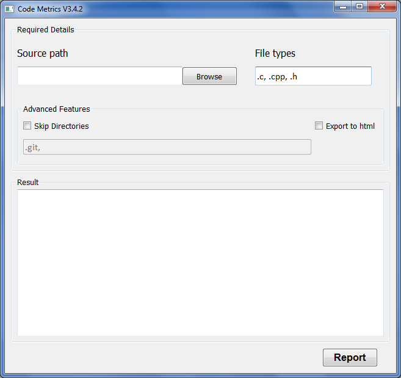
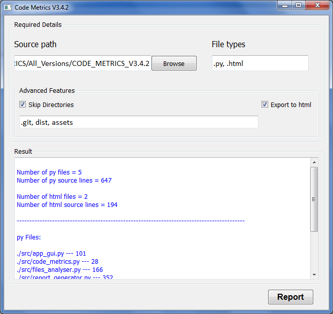
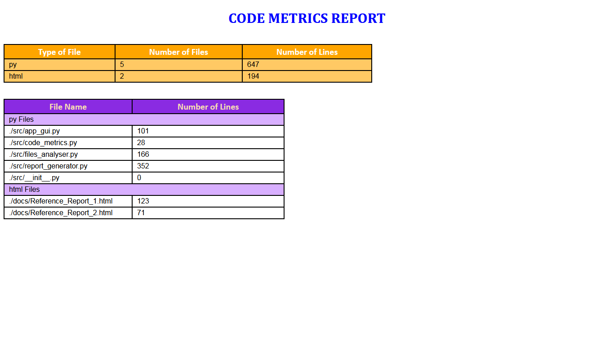

# **CodeMetrics**

This repo contains simple implementation of code metrics collection software. This software is easy to use with minimal configuration options and generates the HTML report.

## Build Dependencies

1. #### pyinstaller
    * If you don't have pyinstaller already installed, execute the following command in cmd prompt:

            pip install pyinstaller

## Build Instructions

1. Double click (run) the *'build.bat'* file. A cmd prompt will open and start building the *exe*.

2. Press *'y'* and *'enter'* key to delete unwanted build files.

3. The *exe* will be created in the *'dist'* folder. Double click (run) the *exe* generated to start the application.

## Application Instructions

1. Give the source path of the project by manually typing or by clicking the *'browse'* button and selecting the folder.

2. Next, give the file extensions used in your project, for which you want to generate the metrics. For example, if your project is a Qt Quick project, you can give *'.cpp, .hpp, .qml'*.

    #### :warning: Ensure that you don't give any non readable format like *'png'* or *'exe'*.

3. If you want to skip few folders like external *'includes'* or reference *'docs'*, you can do so selecting the *'Skip Directories'* checkBox and providing the folder names in the entry.

4. You can select the *'Export to html'* checkBox to get a neat html report generated at runtime. But you can also do this step after checking the preview report shown at the *'Result'* console.

5. :thumbsup: Now you are ready to go! Click the *'Report'* button and see the result.

###

